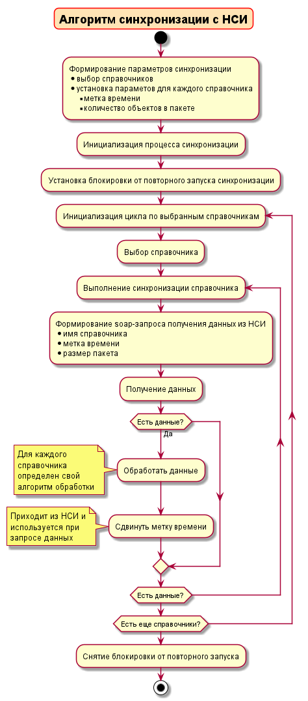
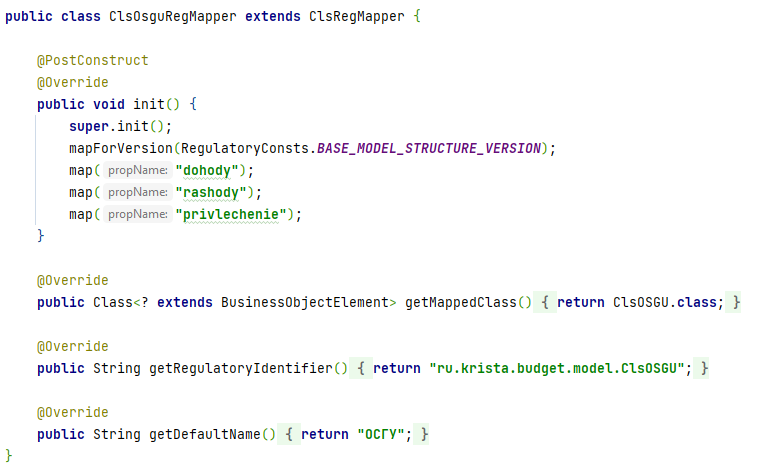
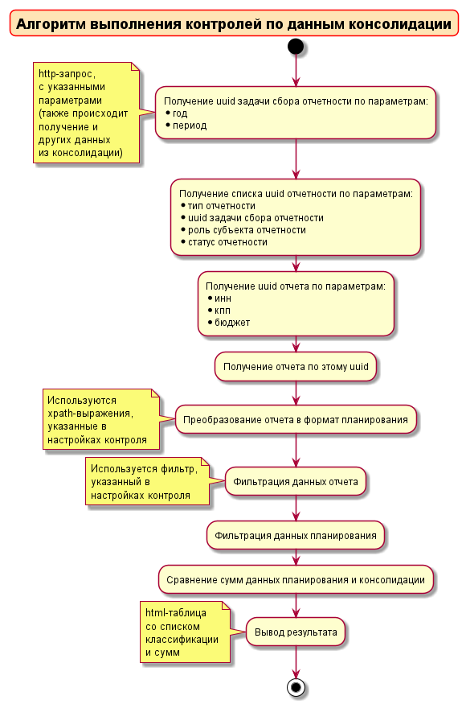
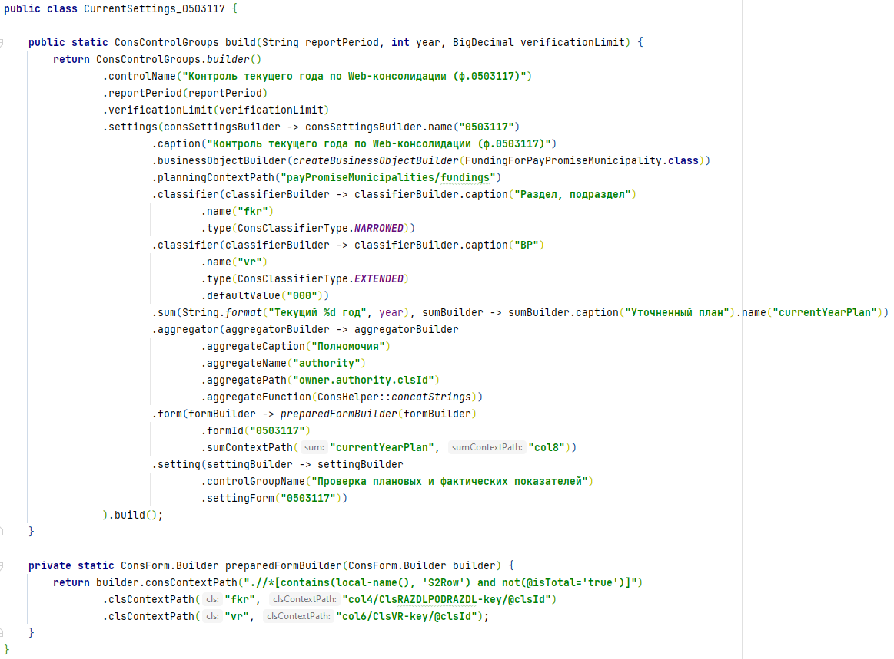
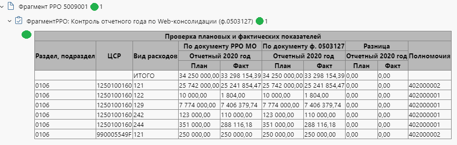
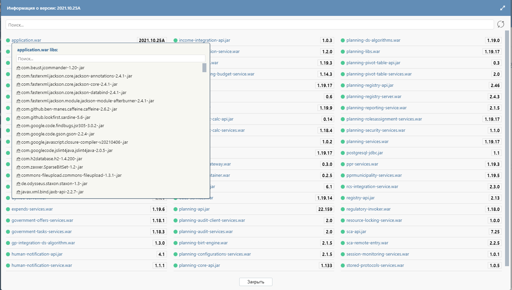
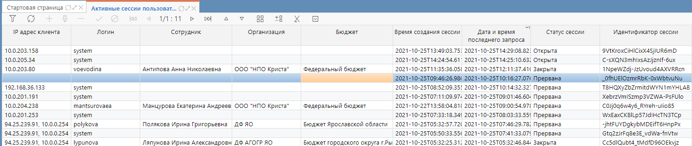
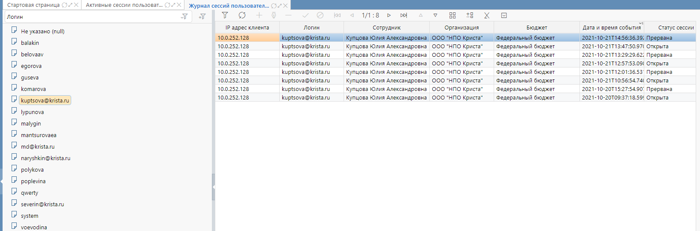
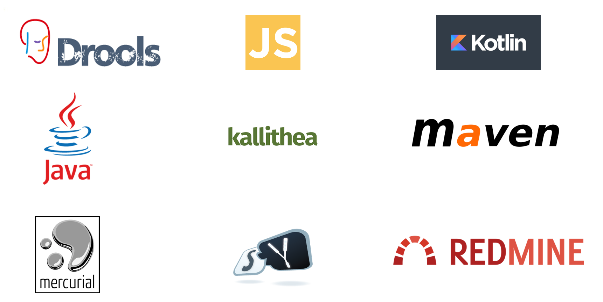

<!--
_class: lead
_paginate: false
-->

# <!-- fit --> Аттестационная презентация
Кузнецов Игорь
Отдел разработки Web-Планирования
Инженер-системный программист 1 категории
kuznetsoviv@krista.ru

---
# Работа в ООО НПО КРИСТА

   

- закончил РГАТУ в 2014 г. по специальности автоматизация ПО
- начал работать в ООО НПО Криста в 2015 г. в проекте планирование бюджета
- в 2016 г. был аттестован на инженера системного программиста 1 категории

---
# Участие в сложных комплексных контрактах

 

- контроли по web-консолидации для Самарской области
- операции экспорта в бюджет для Краснодарского края
- схема с резервированием экспорта в бюджет для Республики Крым
- реализация клиентских операций Расчета ПОБА для Новосибирской области
- операции по импорту данных для РосГвардии
- импорт из ПС «ГосЗадание» для Тульской области
- настройка контролей по сопоставлению РО и КБК для республики Башкортостан
- типовые доработки синхронизации с НСИ

---

# Синхронизация с НСИ

---

# Контроли по web-консолидации

## Требования к выполнению контролей по web-консолидации

- поддержка dsl-настроек контролей:
  - указание кода формы консолидации
  - указание xpath выражений, используемых при маппинге формы
  - указанные фильтров для данных планирования и консолидации
  - указание агрегатов данных, используемых для дополнительной информации при выводе результата  
- поддержка возможности настройки таблицы вывода результата контролей

---

# Контроли по web-консолидации

---

# Контроли по web-консолидации

---

# Интерфейс мониторинга приложений 

---

# Интерфейсы пользовательских сессий

---

# Используемые инструменты

---

# Педагогическая деятельность

   

- являлся наставником у студентов, проходящих прктику
- консультировал сотрудников, находящихся на испытательном сроке
- активно участвую в обмене информацией между коллегами

---

# Компетенции

- Приверженность
    - стаж работы в компании более 5 лет
- Ответственность
    - заинтересован, чтобы выполняемые мной задачи, работали в соответствии ожиданиям пользователя
    - консультируюсь с коллегами по поводу неточностей в постановках и способам их устранения
- Критическое мышление
    - анализирую поступающие задачи и оцениваю риски при их выполнении
    - выделяю приоритет при решении задач
- Эмоциональный интеллект
    - контролирую свои эмоции
    - общаюсь с коллегами в соответствии с их эмоциональным состоянием
- Нацеленность на результат
    - заинтересован в решении поставленной мне задаче
- Знание организации	
    - осведомлен о процессе выполнения задач в отделе
 
---

 # Планируемая дальнейшая деятельность в компании

   

 - изучение и разработки бизнес процессов на kotlin
 - развивать имеющийся интструментарий
 - решать задачи развития, требующие проектирования

---

     

# <!-- fit --> Благодарю за внимание!
     

